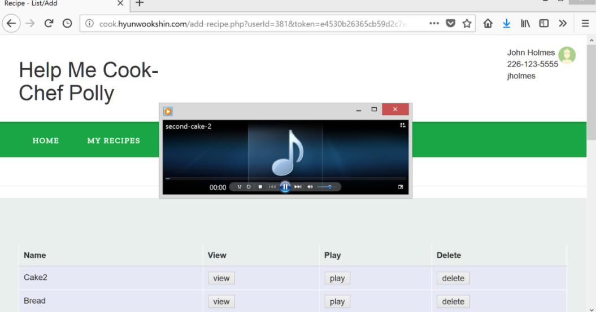
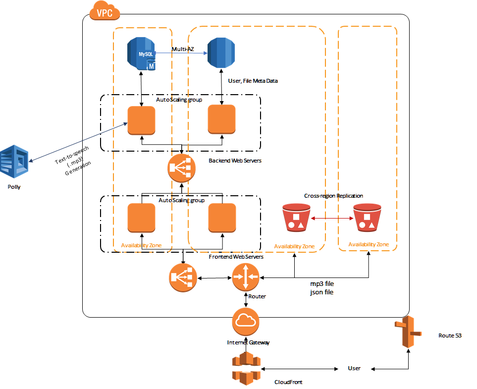

# Help Me cook! ~Chef Polly

- *University Name*: http://www.sjsu.edu/
- *Course*: Cloud Technologies
- *Professor* Sanjay Garje
- *ISA*: Divyankitha Urs
- *Group Members*: HYUNWOOK SHIN, MOJDEH KEYKHANZADEH, VIDHI SHARMA, BARKHA CHOITHANI

## Introduction

Feeling tired looking at the recipe while cooking? You are not alone. The traditional
recipe pages and blogs are good for researching new recipes to try out. But, inside
the kitchen environment, it is difficult to check the next step on your phone or search online.
This app is designed to be like Siri of cooking, helping and guiding you through
the recipe live while you cook!

## Screen shots


## Architecture Diagram


## AWS Components

   **Core Components**

   - S3 Buckets with cross-region replication
   - OAI for limiting S3 buckets access to clountfront
   - Route53 and DNS setup
   - MySQL server with RDS with Multi-AZ (src/backend)
   - Autoscaling groups for frontend and backend servers
   - PHP, JS, CSS, HTML for frontend server (src/frontend)
   - Python Flask for backend application server (src/flaskapp.py)
   - ELB from frontend servers and backend servers
   - CloudWatch/SNS for CPU monitoring and Lambda function logs
   - Lambda Function (src/lambda)
   - Polly for converting from text to .mp3 (src/lambda)
   - IAM Role for Lambda
   - CloudFront for downloading .mp3 file
   - User Authentication

   **EXtra Components**
   - Kinesis
   - DynamoDB

## Demo for trying out
- Endpoint is http://cook.hyunwookshin.com
- Please use the credentials (username: jholmes, password: helloworld)

## Settings

The addresses used in the code are:
- cook.hyunwookshin.com : CNAME for elb fronting the front-end web servers
- cmpe281p2f-351513d65b031117.elb.us-east-2.amazonaws.com : hostname for elb fronting the backend-web servers 
- d36tn81c22y883.cloudfront.net - cloudfront url for mp3 files

If theses addresses change, we should update the code to reflect the new endpoints.

## To build artificats

There is only one artificat for our project. To build the artifacts
please use the following.

```
cd src
make clean
make all
```

Please find the .zip file generated by the make process.

## Frontend installer

Inside src, copy bld/frontend-installer.sh and the artifact (.zip) to EC2 instance,
and run the installer. The artifact should be in the same directory as the installer.

```
sudo ./frontend-installer.sh
```
Please note that the hostname to the backend ELB endpoint is hardcoded for this project.
Therefore, you may need to manually change the endpoints, if the backend ELB
server hostname changes.

## Backend installer

Inside src, copy bld/backend-installer.sh and the artifact (.zip) to EC2 instance,
and run the installer. The artifact should be in the same directory as the installer.

```
sudo ./backend-installer.sh aws-key aws-id aws-secret mysqlpasswrd
```
